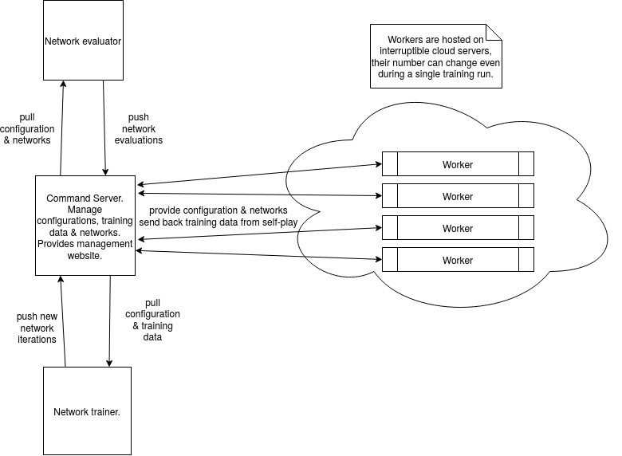

This is the code used in my Master's Thesis "Investigation of possible improvements to increase the efficiency of the AlphaZero algorithm."
The image below shows the basic architecture of the framework. All code is in the folder src.

# Setup

To reproduce my results you will need to setup the central server that manages the experimental runs, called command. The machine used should have at least 8, better 16GB of RAM and preferably a quad core CPU to handle the data transfers and statistics analysis done on the server. HDD size should be a few GB per training run.

1. The server is meant to run on ubuntu 18.04, other OS are not tested
2. Install postgres (10.x), python 3.7 anaconda, nginx, and for some of the experiments, node.js.
3. Checkout this repository on the server and install the dependencies outlined in src/req_command.txt
4. Setup nginx and configure it as outlined in the example file in configs/nginx. The python based server will run on port 8042, nginx will add SSL and reverse proxy. You could skip nginx, if you don't want to bother with nginx and let's encrypt SSL.
5. Setup a database in postgres using the file in src/setup.sql
6. The server needs a configuration file called server.json, there is in an example in configs/server.json. Change the config values to fit your system, databaseuse, etc. dataPath is a directory where binary data will be stored (stored networks and self-play training examples). Secret is a simple password used in the APIs.
7. You can then start the command server like so: python -m core.mains.command --config server.json

